YouTube Trending Videos
================

  - [1. Background](#background)
      - [Why this dataset?](#why-this-dataset)
      - [What are Trending Videos and why are they
        important?](#what-are-trending-videos-and-why-are-they-important)
      - [Purpose of this analysis:](#purpose-of-this-analysis)
      - [To whom might this be helpful?](#to-whom-might-this-be-helpful)
      - [Dataset information:](#dataset-information)
      - [Key Insights:](#key-insights)
  - [2. Data import, tidying, cleaning](#data-import-tidying-cleaning)
      - [2.1. Import](#import)
      - [2.2. Clean and tidy data](#clean-and-tidy-data)
  - [3. Analysis](#analysis)
      - [3.1. Correlation](#correlation)
          - [Key insights from the correlation
            analysis:](#key-insights-from-the-correlation-analysis)
      - [3.2. Trending Date](#trending-date)
          - [3.2.1. What do the overall stats look like based on the
            trending
            date?](#what-do-the-overall-stats-look-like-based-on-the-trending-date)
          - [3.2.2. How long does a video typically trend
            for?](#how-long-does-a-video-typically-trend-for)
          - [3.2.3. How long does it take for a video to become trending
            for the first
            time?](#how-long-does-it-take-for-a-video-to-become-trending-for-the-first-time)
          - [3.2.4. Are there any differences in the amount of videos
            that trended each
            month?](#are-there-any-differences-in-the-amount-of-videos-that-trended-each-month)
      - [3.3. Views](#views)
          - [3.3.1. What do the overall stats look like for
            views?](#what-do-the-overall-stats-look-like-for-views)
          - [3.3.2. Overall, what’s the spread of views for those that
            reached trending (in
            millions)?](#overall-whats-the-spread-of-views-for-those-that-reached-trending-in-millions)
          - [3.3.3. What does the profile look like for the majority of
            the videos that never reached the 1m views
            mark?](#what-does-the-profile-look-like-for-the-majority-of-the-videos-that-never-reached-the-1m-views-mark)
          - [3.3.4. Is a video required to trend for more than a day in
            order to get the best
            results?](#is-a-video-required-to-trend-for-more-than-a-day-in-order-to-get-the-best-results)
      - [3.4. Category](#category)
          - [3.4.1. How do categories differ in terms of the amount of
            videos that made it on the trending
            page?](#how-do-categories-differ-in-terms-of-the-amount-of-videos-that-made-it-on-the-trending-page)
          - [3.4.2. How do categories differ in terms of
            views?](#how-do-categories-differ-in-terms-of-views)
          - [3.4.3. What does the spread of views within each category
            look
            like?](#what-does-the-spread-of-views-within-each-category-look-like)
      - [3.5. Engagement](#engagement)
          - [3.5.1. General stats by country](#general-stats-by-country)
          - [3.5.2. What are the most/least controversial
            categories?](#what-are-the-mostleast-controversial-categories)
          - [3.5.3. How do the countries differ based on the spread of
            the % of
            dislikes?](#how-do-the-countries-differ-based-on-the-spread-of-the-of-dislikes)
          - [3.5.4. How do the countries differ based on the % of videos
            disliked?](#how-do-the-countries-differ-based-on-the-of-videos-disliked)
  - [4. Further analysis:](#further-analysis)
      - [Additional data fields that could provide an even better
        understanding:](#additional-data-fields-that-could-provide-an-even-better-understanding)
          - [a) Public Data:](#a-public-data)
          - [b) Private Data (only the creator can access
            these)](#b-private-data-only-the-creator-can-access-these)
      - [Other uses for this dataset:](#other-uses-for-this-dataset)

# 1\. Background

### Why this dataset?

YouTube has been an influential source of knowledge both in my
professional life as well in my personal goals/ambitions. Thus, I
thought it would be interesting to **explore** this dataset, gather
**insights** and understand the more about the platform.

### What are Trending Videos and why are they important?

Trending videos work alongside the home page to provide users with
content to watch. While the home page is **highly personalised** (via
the YouTube algorithm) on previous views, what the user watched longest,
engagement, subscriptions, the trending page is **very broad and
identical across all accounts**. Since it shows this feed to hundreds of
thousands of accounts, it serves as a great source of views for content
creators (think viral videos).


### Purpose of this analysis:

1.  **Develop an understanding of the YouTube Trending Videos**
2.  **Assess differences between English-speaking countries (Canada,
    Great Britain, United States of America)**

*Thus, all throughout, we will generate questions, answer them with data
and then further refine these questions based on what was discovered.*

### To whom might this be helpful?

  - Content Creators / Marketing Agencies can get a better understanding
    of the audience which would help tailor content
  - Data Science enthusiasts, as they might get new ideas for how to use
    R (for beginners) or see other people’s analyses (for intermediates)
  - Those that are generally interested in YouTube

### Dataset information:

  - Contains \>120,000 videos across three countries (Canada, Great
    Britain, United States of America)
  - 8 months of Daily Trending data between “2017-11-14” and
    “2018-06-14” (approx 200 videos/day/country)
  - All the data is downloaded from
    <https://www.kaggle.com/datasnaek/youtube-new> - *Raw data files are
    available within the “Datasets” folder*

### Key Insights:

  - Canada has a significantly different profile as it regards unique
    videos that were trending (60%) versus Great Britain (8%) and The
    United States of America (16%)
  - Most videos (80%) in CA only trend for 1-2 days versus GB and US
    where it isn’t uncommon to trend for up to 10 days (highest 38 days)
  - Only 25% of all videos receive over 1 million views and 5% receive
    over 5 million
  - Music and Entertainment are the most predominant categories
  - News\&Politics is the most controversial category (as judged by % of
    dislikes), while Pets\&Animals and Comedy are the least disliked

# 2\. Data import, tidying, cleaning

The following packages were needed to produce the output:

``` r
library(ggplot2)
library(dplyr)
library(lubridate)
library(data.table)
library(readr)
library(rjson)
library(jsonlite)
library(ggcorrplot)
library(knitr)
```

### 2.1. Import

``` r
#get datasets for the countries we're interested in (10 countries are available)
gb_data <- read_csv("~/DS/YouTube-Trending-Videos-EDA/Datasets/GBvideos.csv")
us_data <- read_csv("~/DS/YouTube-Trending-Videos-EDA/Datasets/USvideos.csv")
ca_data <- read_csv("~/DS/YouTube-Trending-Videos-EDA/Datasets/CAvideos.csv")

#add a flag so that we know which country belongs to which dataset
gb_data$country <- "GB"
us_data$country <- "US"
ca_data$country <- "CA"

#get category data
us_cat_json <- fromJSON("~/DS/YouTube-Trending-Videos-EDA/Datasets/US_category_id.json")
gb_cat_json <- fromJSON("~/DS/YouTube-Trending-Videos-EDA/Datasets/GB_category_id.json")
ca_cat_json <- fromJSON("~/DS/YouTube-Trending-Videos-EDA/Datasets/CA_category_id.json")
summary(us_cat_json)

#bind together
US_category <-  as.data.frame(cbind(us_cat_json[["items"]][["id"]], us_cat_json[["items"]][["snippet"]][["title"]]))
GB_category <-  as.data.frame(cbind(gb_cat_json[["items"]][["id"]], gb_cat_json[["items"]][["snippet"]][["title"]]))
CA_category <-  as.data.frame(cbind(ca_cat_json[["items"]][["id"]], ca_cat_json[["items"]][["snippet"]][["title"]]))

#change column names
names(US_category) <- c("category_id","category_title")
names(GB_category) <- c("category_id","category_title")
names(CA_category) <- c("category_id","category_title")

#merge data
us_data <- merge(x = us_data, y = US_category, by = "category_id")
gb_data <- merge(x = gb_data, y = GB_category, by = "category_id")
ca_data <- merge(x = ca_data, y = CA_category, by = "category_id")

#combine into one dataset
raw_data <- as.data.table(rbind(gb_data, us_data, ca_data))

#remove unnecessary variables from memory
rm(us_data, gb_data, ca_data)
rm(US_category, GB_category, CA_category)
rm(us_cat_json, gb_cat_json, ca_cat_json)
```

### 2.2. Clean and tidy data

``` r
#I usually like to save a backup of the raw data to make it easier to revert changes (if needed) so let's do that
raw_data_backup <- raw_data

#let's check the structure of the data
glimpse(raw_data)
```

    ## Observations: 120,582
    ## Variables: 18
    ## $ category_id            <dbl> 1, 1, 1, 1, 1, 1, 1, 1, 1, 1, 1, 1, 1, 1, 1,...
    ## $ video_id               <chr> "YFHHGETsxkE", "OTu9N40E_MI", "4HU6Z7anycw",...
    ## $ trending_date          <chr> "18.25.03", "18.01.03", "18.07.03", "18.25.0...
    ## $ title                  <chr> "PAPERS, PLEASE - The Short Film (2018) 4K S...
    ## $ channel_title          <chr> "<U+041D><U+0438><U+043A><U+0438><U+0442><U+0430> <U+041E><U+0440><U+0434><U+044B><U+043D><U+0441><U+043A><U+0438><U+0439>", "Best F(r)iends", "Lucas...
    ## $ publish_time           <dttm> 2018-02-24 15:59:25, 2018-02-23 18:00:38, 2...
    ## $ tags                   <chr> "<U+043A><U+0438><U+043D><U+043E>\"|\"<U+043A><U+043E><U+0440><U+043E><U+0442><U+043A><U+0438><U+0439> <U+043C><U+0435><U+0442><U+0440>\"|\"<U+043A><U+043E><U+0440><U+043E><U+0442><U+043A><U+043E><U+043C><U+0435><U+0442><U+0440><U+0430><U+0436><U+043A><U+0430>\...
    ## $ views                  <dbl> 1978034, 189641, 3938807, 34269048, 2155048,...
    ## $ likes                  <dbl> 183142, 3652, 234925, 440650, 96634, 37594, ...
    ## $ dislikes               <dbl> 1360, 64, 4555, 19239, 4120, 3222, 493, 1241...
    ## $ comment_count          <dbl> 10772, 481, 15724, 48269, 14218, 6476, 357, ...
    ## $ thumbnail_link         <chr> "https://i.ytimg.com/vi/YFHHGETsxkE/default....
    ## $ comments_disabled      <lgl> FALSE, FALSE, FALSE, FALSE, FALSE, FALSE, FA...
    ## $ ratings_disabled       <lgl> FALSE, FALSE, FALSE, FALSE, FALSE, FALSE, FA...
    ## $ video_error_or_removed <lgl> FALSE, FALSE, FALSE, FALSE, FALSE, FALSE, FA...
    ## $ description            <chr> "SUBTITLES AVAILABLE (EN, RU, CS, DA, DE, EL...
    ## $ country                <chr> "GB", "GB", "GB", "GB", "GB", "GB", "GB", "G...
    ## $ category_title         <fct> Film & Animation, Film & Animation, Film & A...

``` r
#we can spot a few class problems as well as add some additional columns

#clean and format dates/times
raw_data$trending_date <- ydm(raw_data$trending_date)
raw_data$publish_date <- ymd(substr(raw_data$publish_time,start = 1,stop = 10))
raw_data$hour <- format(strptime(raw_data$publish_time,"%Y-%m-%d %H:%M:%S"),'%H')
raw_data$days_diff <- as.numeric(raw_data$trending_date-raw_data$publish_date)

#remove unnecessary fields
raw_data <- raw_data %>%
        select(-description, -tags, -category_id, -publish_time)

#add new columns for further analysis
raw_data <- raw_data %>%
        mutate(perc_engagement = round((likes + dislikes + comment_count) / views, digits = 2)*100,
               perc_likes = round(likes / (likes+dislikes), digits=2)*100,
               perc_comments = round(comment_count/views, digits = 2) * 100)

#we also want to change hour and country fields to factors
raw_data$hour <- as.factor(raw_data$hour)
raw_data$country <- as.factor(raw_data$country)

#remove video_error_or_removed videos as we do not want these as these videos would've been deleted/errors/copyright violations
table(raw_data$video_error_or_removed)
```

    ## 
    ##  FALSE   TRUE 
    ## 120463    119

``` r
#it's looks like it's an extremely dataset so we can safely remove these
video_error_or_removed <- raw_data %>% 
        filter (video_error_or_removed == "TRUE")%>%
        select(country, channel_title, title, video_id) %>%
        group_by(country, channel_title, title, video_id) %>%
        summarize(count = n()) %>% #count = days_trending
        arrange(desc(count))

#let's also remove the unecessary column and clean the variable from the environment
raw_data <- raw_data %>%
        filter (video_error_or_removed == "FALSE") %>%
        select (-video_error_or_removed)
        
rm(video_error_or_removed)

#check for NAs
raw_data %>% summarise_all(~ sum(is.na(.)))
```

    ##   video_id trending_date title channel_title views likes dislikes comment_count
    ## 1        0             0     0             0     0     0        0             0
    ##   thumbnail_link comments_disabled ratings_disabled country category_title
    ## 1              0                 0                0       0              0
    ##   publish_date hour days_diff perc_engagement perc_likes perc_comments
    ## 1            0    0         0               0        720             0

``` r
#720 NA values but at this point we're not sure if that's because of the fact that some creators choose to hide their ratings
raw_data %>% filter(is.na(perc_likes)) %>% group_by(ratings_disabled) %>% summarize (count = n())
```

    ## # A tibble: 2 x 2
    ##   ratings_disabled count
    ##   <lgl>            <int>
    ## 1 FALSE                3
    ## 2 TRUE               717

``` r
#it looks like that's the case for al but 3 of them
#these three videos show as NA due to not having any likes/dislikes so we will adjust the calculation slightly
raw_data <- raw_data %>% mutate(perc_likes = ifelse(ratings_disabled == "FALSE" & likes==0, 0, round(likes / (likes+dislikes), digits=2)*100))

#let's check
raw_data %>% filter(is.na(perc_likes)) %>% group_by(ratings_disabled) %>% summarize (count = n())
```

    ## # A tibble: 1 x 2
    ##   ratings_disabled count
    ##   <lgl>            <int>
    ## 1 TRUE               717

``` r
#this error has been fixed now and NAs are only showing for those with ratings disabled

#check for NULLs
raw_data %>% summarise_all(~ sum(is.null(.)))
```

    ##   video_id trending_date title channel_title views likes dislikes comment_count
    ## 1        0             0     0             0     0     0        0             0
    ##   thumbnail_link comments_disabled ratings_disabled country category_title
    ## 1              0                 0                0       0              0
    ##   publish_date hour days_diff perc_engagement perc_likes perc_comments
    ## 1            0    0         0               0          0             0

``` r
#no issues with NULLs
```

Lastly, there are a couple columns that we need to look into further as
I am not fully confident I understand:

  - “comments\_disabled”
  - “ratings\_disabled”

<!-- end list -->

``` r
#check how much of the data has comments disabled
table(quantile(raw_data$comments_disabled, probs = seq(0, 1, length.out=101)))
```

    ## 
    ##  0  1 
    ## 99  2

``` r
#check how much of the data has ratings disabled
table(quantile(raw_data$ratings_disabled, probs = seq(0, 1, length.out=101)))
```

    ## 
    ##   0   1 
    ## 100   1

``` r
#back up our existing data one last time
raw_data_backup <- raw_data
```

Since the sample of videos that has comments/ratings disabled is very
small, this won’t affect our analysis too much (if at all).

We also don’t want to remove these completely because videos that have
comments disabled *could* have ratings enabled and vice-versa. Plus, if
a creator disabled comments due to a controversial topic, we want to see
if that’s impacted ratings in any way (if enabled).

# 3\. Analysis

While the below main themes aren’t exclusive of each other (as sometimes
they are mixed), I decided to structure the analysis based on the main
variables I was looking at:

  - 3.1. Correlation
  - 3.2. Views
  - 3.3. Trending Date
  - 3.4. Engagement
  - 3.5. Category

## 3.1. Correlation

Let’s have a look at the covariation between our main variables:

``` r
raw_data_corr <- raw_data %>% select(views,likes,dislikes, comment_count, days_diff)

# Compute a correlation matrix
corr <- round(cor(raw_data_corr), 2)

# Compute a matrix of correlation p-values
pmat <- cor_pmat(raw_data_corr)
```

``` r
knitr::kable(pmat, 
             caption = "Fig 1 - Matrix of correlation p-values",
             digits = 3)
```

|                | views | likes | dislikes | comment\_count | days\_diff |
| :------------- | ----: | ----: | -------: | -------------: | ---------: |
| views          | 0.000 |     0 |    0.000 |              0 |      0.093 |
| likes          | 0.000 |     0 |    0.000 |              0 |      0.000 |
| dislikes       | 0.000 |     0 |    0.000 |              0 |      0.086 |
| comment\_count | 0.000 |     0 |    0.000 |              0 |      0.000 |
| days\_diff     | 0.093 |     0 |    0.086 |              0 |      0.000 |

Fig 1 - Matrix of correlation p-values

Let’s visualise our correlation output:

``` r
# Visualize the correlation matrix
ggcorrplot(corr, method = "square", 
           ggtheme = ggplot2::theme_minimal, 
           title = "Medium to High correlations between our main variables",
           outline.col = "black",
           colors = c("blue","white", "red"),
           lab = TRUE,
           digits = 2)
```

<!-- -->

### Key insights from the correlation analysis:

*(remember to not confuse correlation with causation)*

  - The highest correlation was between **views** and **likes**
  - High correlation between **likes** and **comment count**, meaning
    that people engaged a lot on the videos they liked *but*
  - There was also a high correlation between **dislikes** and **comment
    count**, meaning people also engaged in comments on videos they
    disliked
  - Together, these two **could** mean people found it easier to
    **like/dislike** a video once they commented (or the other way
    around)

## 3.2. Trending Date

### 3.2.1. What do the overall stats look like based on the trending date?

``` r
#set up overall dataset
trending_summary <- raw_data %>%
  select(country,video_id) %>%
  group_by(country) %>%
  summarize(count = n(),
            unique = n_distinct(video_id))

ggplot(trending_summary)+
  geom_col(aes(country, count, fill = country), show.legend = FALSE)+
  geom_line(aes(country,unique), group = 1, lwd = 1, col = "black", lty = 2)+
  geom_label(aes(country, unique, label = paste(round(unique/count*100), "% unique", sep = "")), fill = "black", col = "white")+
  labs(y = "Total Trending Videos",
       x = NULL,
       title = "Despite a similar number of total trending videos, CA has a different \nprofile to GB and US with considerably more unique videos")
```

<!-- -->

### 3.2.2. How long does a video typically trend for?

``` r
#set up data
trending_duration <- raw_data %>%
  select(country, video_id, trending_date) %>%
  group_by(country, video_id) %>%
  summarize(count = n())

ggplot(trending_duration, aes(count, ..prop.., fill = country))+
  geom_bar()+
  facet_grid(.~country)+
  theme(legend.position = "none") + 
  labs(y = "% of Unique Trending Videos",
       x = "Max Trending Days",
       fill = "Country",
       title = "CA has a short trending timespan where >80% videos trend 1-2 days \nIn the US and GB this is more spread out: only 10-20% trend for 1-2 days",
       subtitle = "It is more common for a video to trend for 20-30 days in the GB/US than 5 days in CA")
```

<!-- -->

### 3.2.3. How long does it take for a video to become trending for the first time?

``` r
#create a new dataset to help answer this question
trending_data <- raw_data %>%
  select(country, video_id, views, days_diff) %>%
  group_by(country, video_id) %>%
  summarize(count = n_distinct(video_id),
            views = max(views),
            days_diff = min(days_diff))
```

Let’s look at a basic spread

``` r
summary(trending_data$days_diff)
```

    ##    Min. 1st Qu.  Median    Mean 3rd Qu.    Max. 
    ##    0.00    1.00    1.00    9.81    2.00 4215.00

Not as detailed as we’d like so let’s see this in increments of 1%

``` r
quantile(trending_data$days_diff, probs = seq(0, 1, length.out=101))
```

    ##   0%   1%   2%   3%   4%   5%   6%   7%   8%   9%  10%  11%  12%  13%  14%  15% 
    ##    0    0    0    0    0    0    0    1    1    1    1    1    1    1    1    1 
    ##  16%  17%  18%  19%  20%  21%  22%  23%  24%  25%  26%  27%  28%  29%  30%  31% 
    ##    1    1    1    1    1    1    1    1    1    1    1    1    1    1    1    1 
    ##  32%  33%  34%  35%  36%  37%  38%  39%  40%  41%  42%  43%  44%  45%  46%  47% 
    ##    1    1    1    1    1    1    1    1    1    1    1    1    1    1    1    1 
    ##  48%  49%  50%  51%  52%  53%  54%  55%  56%  57%  58%  59%  60%  61%  62%  63% 
    ##    1    1    1    1    1    1    1    1    1    1    1    1    1    1    1    1 
    ##  64%  65%  66%  67%  68%  69%  70%  71%  72%  73%  74%  75%  76%  77%  78%  79% 
    ##    1    1    1    1    1    1    1    1    1    1    1    2    2    2    2    2 
    ##  80%  81%  82%  83%  84%  85%  86%  87%  88%  89%  90%  91%  92%  93%  94%  95% 
    ##    2    2    2    2    2    2    2    2    2    2    3    3    3    3    4    4 
    ##  96%  97%  98%  99% 100% 
    ##    5    6    9   18 4215

We can now see that 99% of videos got on the trending page within 0-18
days from publish date. We will use this 99th percentile as a max limit
for our graphs for a clearer visualisation.

``` r
max_limit <- quantile(trending_data$days_diff, probs = c(0.99))

#let's visualise this
ggplot(trending_data, aes(as.factor(days_diff), count))+
  geom_col(fill = "dark red")+
  coord_cartesian(xlim=c(0,max_limit))+
  labs(y = "Unique Trending Videos",
       x = "Days Until Trending",
       title = "~75% of videos became trending within their first day and ~95% took < 5 days",
       subtitle = "It is unlikely for a video to reach the trending page if it hasn't done so within the first 10 days")
```

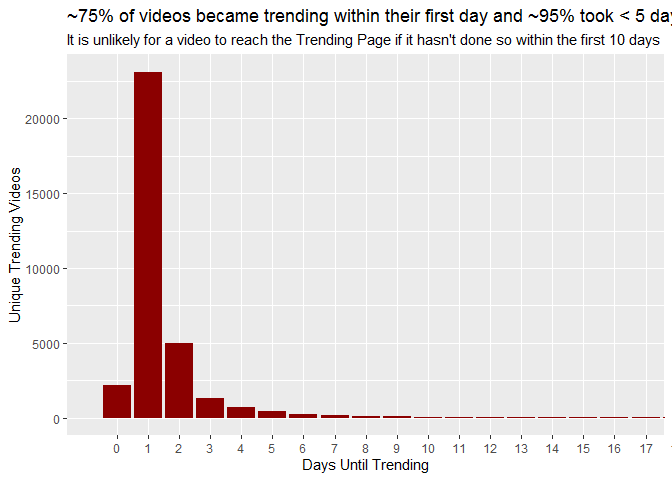<!-- -->

Let’s segment this by Country.

``` r
#Is there a difference between countries?
ggplot(trending_data, aes(days_diff, count, fill = country))+
  geom_col()+
  coord_cartesian(xlim=c(0,max_limit))+ #zooming in on the area of interest (99% of the data)
  facet_grid(.~country)+
  theme(legend.position = "none") + 
  labs(y = "Unique Trending Videos",
       x = "Days Until Trending",
       fill = "Country",
       title = "Videos in Canada videos tend to become trending very quickly, \nunlike the US where this spread is wider, and GB where it is widest")
```

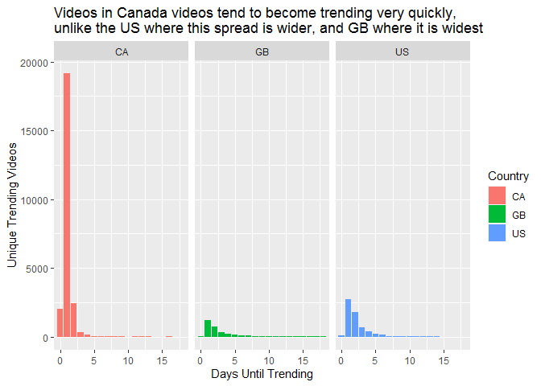<!-- -->

### 3.2.4. Are there any differences in the amount of videos that trended each month?

``` r
#create dataset
trending_by_day <- raw_data %>%
  select(country, trending_date) %>%
  group_by(country, day=floor_date(trending_date, "day")) %>%
  summarize(count = n())

ggplot(trending_by_day, aes(day, count, col = country)) + 
  geom_smooth(lwd = 2, se = FALSE)+
  scale_x_date(date_breaks = "20 days", date_labels = "%d-%b")+
  labs(y = "Total Trending Videos (Moving Average)",
       x = NULL,
       col = "Country",
       title = "No significant differences up until March (~200 videos per country per day) \nThere was a drop in GB volumes afterwards",
       subtitle = "It is hard to tell if this was due to a data collection error or the trending process changed")
```

<!-- -->

## 3.3. Views

### 3.3.1. What do the overall stats look like for views?

``` r
#create dataset
views_summary <- raw_data %>%
  select(country,video_id,views) %>%
  group_by(country, video_id) %>%
  summarize(count = n(),
            unique = n_distinct(video_id),
            views = max(views)) %>%
  group_by(country) %>%
  summarize(count = sum(count),
            unique = round(sum(unique)/1000),
            views = sum(views)/1000000000)

ggplot(views_summary)+
  geom_col(aes(country, views, fill = country))+
  geom_line(aes(country,unique), group = 1, lwd = 2, col = "black", lty = 3)+
  geom_label(aes(country, unique, label = unique), fill = "black", col = "white")+
  theme(legend.position = "none") + 
  annotate("text", x = 2.7, y = 7.35, label = "Unique Trending Videos (thousands)", angle = 14, lwd = 4.5)+
  labs(y = "Total Views (billions)",
       x = NULL,
       title = "CA leads in total views (8x more unique videos than GB and 4x more than US) \nGB has more Views than US, despite having ~50% fewer videos")
```

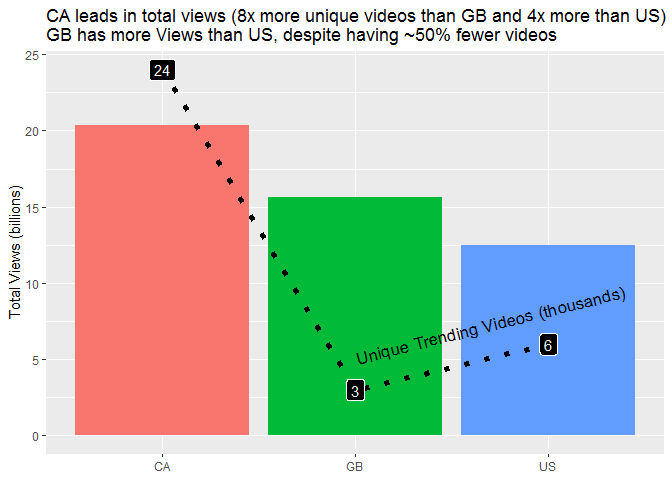<!-- -->

### 3.3.2. Overall, what’s the spread of views for those that reached trending (in millions)?

``` r
views_data <- raw_data %>%
  select(country,video_id,views) %>%
  group_by(country, video_id) %>%
  summarize(count = n(),
            unique = n_distinct(video_id),
            views = max(views),
            views_m_reached = floor(views/1000000),
            views_rounded = round(views/1000000))
```

Let’s look at a basic spread of the Views per Video across all countries

``` r
table(quantile(views_data$views_m_reached, probs = seq(0, 1, length.out=101)))
```

    ## 
    ##   0   1   2   3   4   5   7  10  19 424 
    ##  77  11   5   2   1   1   1   1   1   1

This is already very helpful as we can see that 77% of videos did not
make it past of million. Similarly, only \~5% made it past the 5m mark.

However, I’d like to see this split even more detailed.

``` r
quantile(views_data$views_m_reached, probs = seq(0, 1, length.out=101))
```

    ##   0%   1%   2%   3%   4%   5%   6%   7%   8%   9%  10%  11%  12%  13%  14%  15% 
    ##    0    0    0    0    0    0    0    0    0    0    0    0    0    0    0    0 
    ##  16%  17%  18%  19%  20%  21%  22%  23%  24%  25%  26%  27%  28%  29%  30%  31% 
    ##    0    0    0    0    0    0    0    0    0    0    0    0    0    0    0    0 
    ##  32%  33%  34%  35%  36%  37%  38%  39%  40%  41%  42%  43%  44%  45%  46%  47% 
    ##    0    0    0    0    0    0    0    0    0    0    0    0    0    0    0    0 
    ##  48%  49%  50%  51%  52%  53%  54%  55%  56%  57%  58%  59%  60%  61%  62%  63% 
    ##    0    0    0    0    0    0    0    0    0    0    0    0    0    0    0    0 
    ##  64%  65%  66%  67%  68%  69%  70%  71%  72%  73%  74%  75%  76%  77%  78%  79% 
    ##    0    0    0    0    0    0    0    0    0    0    0    0    0    1    1    1 
    ##  80%  81%  82%  83%  84%  85%  86%  87%  88%  89%  90%  91%  92%  93%  94%  95% 
    ##    1    1    1    1    1    1    1    1    2    2    2    2    2    3    3    4 
    ##  96%  97%  98%  99% 100% 
    ##    5    7   10   19  424

At this point, we can see that 99% of the data has between 0m views to
19m views. For a clearer visualisation, let’s set a max limit up to this
99th percentile as a max limit for our graphs and visualise the data.

``` r
max_limit <- quantile(views_data$views_m_reached, probs = c(0.99))

ggplot(views_data, aes(views_m_reached, count))+
  geom_col(fill="dark red")+
  coord_cartesian(xlim=c(0,max_limit))+
  labs(y = "Unique Trending Videos",
       x = "Views (millions)",
       title = "Only ~25% of videos receive more than 1 million views \nMost (~95%) of the videos haven't reached the 5m view count")+
  geom_vline(xintercept=0.51, lwd = 1, col = "black", lty = 1)+
  annotate("text", x = 0.8, y = 29000, label = "76% of data", angle = 90)+
  geom_vline(xintercept=4.5, lwd = 1, col = "black", lty = 5)+
  annotate("text", x = 4.8, y = 29000, label = "95% of data", angle = 90)+
  geom_vline(xintercept=max_limit+0.5, lwd = 1, col = "black", lty = 2)+
  annotate("text", x = max_limit-0.3+0.4, y = 29000, label = "99% of data", angle = 90)
```

<!-- -->

Let’s segment this by country and see if there are any major profile
differences. To account for the different in unique videos shown, we
will look at the % of videos in each bucket rather than absolute number.

``` r
ggplot(views_data)+
geom_bar(aes(views_m_reached, ..prop.., fill = country))+
facet_grid(~country)+
theme(legend.position = "none") + 
coord_cartesian(xlim=c(0,max_limit))+
labs(y = "% of Unique Trending Videos",
       x = "Views (millions)",
       fill = "Country",
       title = ">~80% of videos in CA do not reach 1m views vs 60%(GB) and 65%(US)",
       subtitle = "The spread of those that reached >5m views is  much narrower in CA than GB and US")
```

<!-- -->

### 3.3.3. What does the profile look like for the majority of the videos that never reached the 1m views mark?

``` r
#let's adapt the dataset to only include the videos that never reached 1m views
views_data_below1m <- views_data %>%
  filter (views_m_reached < 1)

#let's visualise this
ggplot(views_data_below1m, aes(views))+
  geom_histogram(fill="dark red", binwidth = 10000)+
  labs(y = "Unique Trending Videos",
       x = "Views",
       title = "The data is highly skewed to the right",
       subtitle = "Most videos tend to have up to 100,000 views after which there's a steep decline")
```

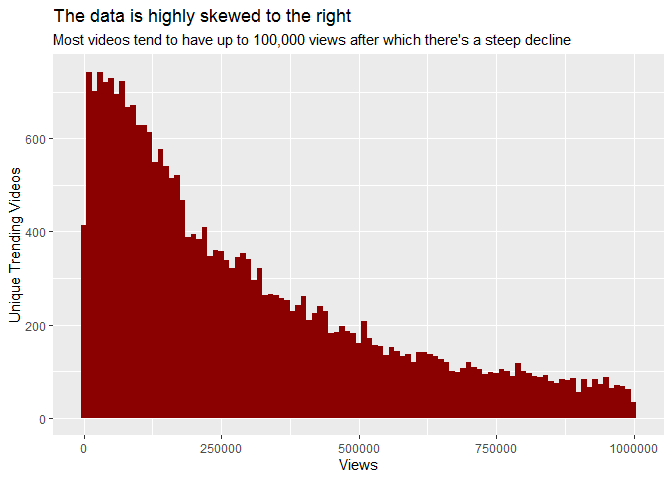<!-- -->

Similarly to before, let’s conduct a segmentation by country and see if
there are any major differences:

``` r
#Segmentation by country
ggplot(views_data_below1m)+
  geom_bar(aes(views, fill = country), binwidth = 10000)+
  facet_wrap(~country)+
  theme(legend.position = "none") + 
  labs(y = "Unique Trending Videos",
       x = "Views",
       fill = "Country",
       title = "The same right-skewed trend was found at a country level")
```

    ## Warning: `geom_bar()` no longer has a `binwidth` parameter. Please use
    ## `geom_histogram()` instead.

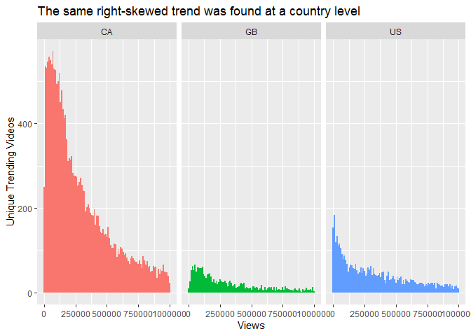<!-- -->

### 3.3.4. Is a video required to trend for more than a day in order to get the best results?

``` r
views_by_video <- raw_data %>% 
  select(video_id, views, country, trending_date) %>%
  group_by(country, video_id, trending_date) %>%
  summarize (views = max(views),
             count = n()) %>%
  group_by(country, video_id) %>%
  summarize(views = max(views)/1000000,
            count = n())

ggplot(views_by_video, aes(as.factor(count), views)) +
  geom_boxplot(outlier.shape = NA, fill = "dark red", col = "black", size = 0.1)+
  geom_smooth(aes())+
  coord_cartesian(ylim = c(0, 80))+
  labs(y = "Max views (million)",
       x = "Total Trending Days",
       title = "The longer a video trends, the more views it accumulates (excludes outliers)",
       subtitle = "However, the sample size decreases significantly with each increase in total trending days")
```

<!-- -->

Let’s check the same trend at a country level

``` r
ggplot(views_by_video, aes(as.factor(count), views)) +
  geom_boxplot(aes(fill = country), outlier.shape = NA, col = "black", size = 0.1)+
  coord_cartesian(ylim = c(0, 100))+
  scale_x_discrete(breaks = seq(0,38,5))+
  theme(legend.position = "none") + 
  labs(y = "Max Views (million)",
       x = "Total Trending Days",
       title = "Irrespective of Country, the longer a video trends, the more views it gets",
       subtitle = "However, it's hard to compare this trend across countries due to different sample sizes")+
  facet_wrap(~country)
```

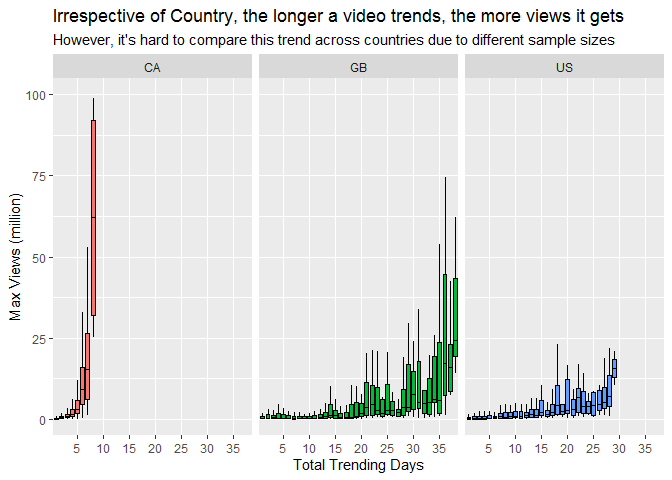<!-- -->

## 3.4. Category

### 3.4.1. How do categories differ in terms of the amount of videos that made it on the trending page?

``` r
raw_data_cat <- raw_data %>%
  select(country, category_title, video_id, views) %>%
  group_by(country, category_title, video_id) %>%
  summarize (count= n(),
             unique_count = n_distinct(video_id),
             views = max(views)) %>%
  group_by(country, category_title) %>%
  summarize (count = sum(count),
             unique_count = sum(unique_count),
             views = sum(views)/1000000) %>%
  arrange(country,desc(count))

#let's visualise (line indicates unique count)
ggplot(raw_data_cat, aes(x=reorder(category_title, count), y = count, fill = category_title)) + 
  geom_bar(stat = "identity") +
  facet_grid(~country) +
  theme(legend.position = "none") + 
  labs(y = "Unique Videos",
       x = NULL,
       title = "Entertainment in the clear outlier in CA\nAlongside Entertainment, Music is very common in GB and US")+
  coord_flip()
```

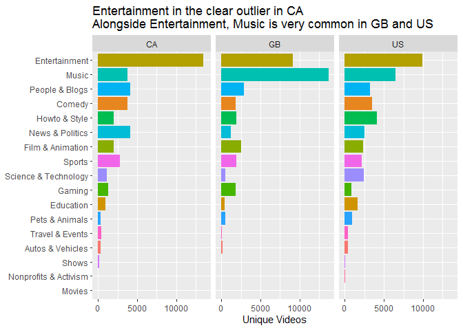<!-- -->

### 3.4.2. How do categories differ in terms of views?

``` r
ggplot(raw_data_cat) + 
  geom_bar(aes(reorder(category_title, views), views, fill = category_title), stat = "identity") +
  geom_line(aes(reorder(category_title,views), unique_count), group = 1, lwd = 0.5, lty = 1) +
  facet_grid(~country) +
  theme(legend.position = "none") + 
  labs(y = "Number of Views (millions)",
       x = NULL,
       title = "In GB, there is a significantly higher number of views within Music \nthan Entertainment, despite a comparable unique video count",
       subtitle = "Bar chart - Total Video Count \nLine chart - Unique Video Count")+
  coord_flip()
```

<!-- -->

This difference in views, despite a comparable number of unique videos,
could mean that those within the Music category have a significantly
higher number of views.

Let’s explore this.

### 3.4.3. What does the spread of views within each category look like?

``` r
raw_data_cat_detail <- raw_data %>%
  select(country, category_title, video_id, views) %>%
  group_by(country, category_title, video_id) %>%
  summarize (count= n(),
             unique_count = n_distinct(video_id),
             views = max(views)/1000000) %>%
  arrange(country,desc(count))

#excluding outliers        
ggplot(raw_data_cat_detail, aes(reorder(category_title, count), views, fill = category_title)) + 
  geom_boxplot(outlier.shape = NA) +
  facet_grid(~country) +
  theme(legend.position = "none") +
  labs(y = "Number of Views (millions)",
       x = NULL,
       title = "Irrespective of country, Music has the largest spread of views",
       subtitle = "Excludes outliers")+
  coord_flip(ylim=c(0,25))
```

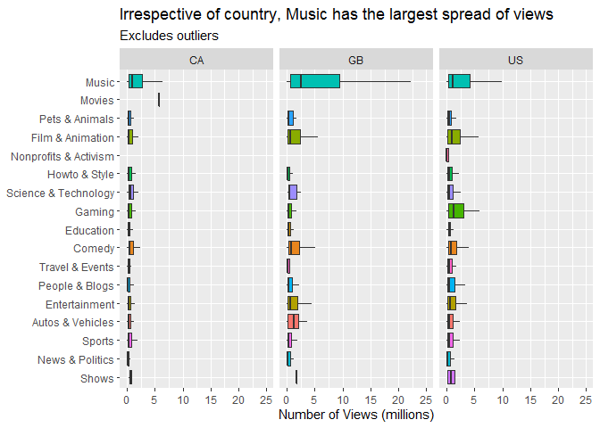<!-- -->

And let’s look at the outliers separately.

``` r
ggplot(raw_data_cat_detail, aes(reorder(category_title, count), views, fill = category_title)) + 
  geom_boxplot(size = 0.5, outlier.shape = 1, outlier.colour = "red", outlier.alpha = 0.3) +
  facet_grid(~country) +
  theme(legend.position = "none") + 
  labs(y = "Views (millions)",
       x = NULL,
       title = "Music tends to have the highest outliers (as high as ~425m Views) \nEntertainment came 2nd (highest outlier at ~160m)")+
  coord_flip()
```

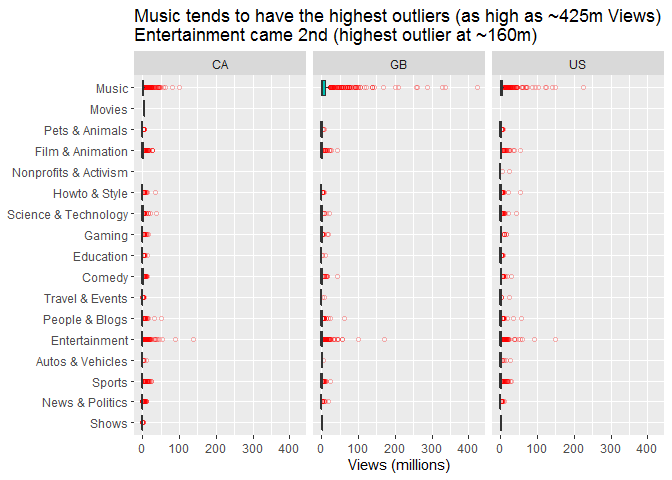<!-- -->

## 3.5. Engagement

### 3.5.1. General stats by country

``` r
raw_data_eng_overall <- raw_data %>%
  select(country, category_title, video_id, trending_date, likes, comment_count, dislikes, views) %>%
  group_by (country) %>%
  summarize (perc_engagement = ((sum(likes)+sum(dislikes)+sum(comment_count))/sum(views))*100,
             perc_dislikes = (sum(dislikes)/(sum(likes)+sum(dislikes)))*100,
             perc_comments_to_views = (sum(comment_count)/sum(views))*100)


ggplot(raw_data_eng_overall) + 
  geom_col(aes(country, perc_dislikes, fill = country)) +
  geom_line(aes(country, perc_engagement), group = 1, lwd = 1, lty = 3) +
  theme(legend.position = "none") + 
  labs(y = "% dislikes / % engagement",
       x = NULL,
       title = "GB has a higher % of dislikes and lower overall engagement",
       subtitle = "Bar chart - % of Dislikes ( Dislikes / ( Likes + Dislikes ) ); \nDotted Line chart - % engagement ( ( Likes + Dislikes + Comments ) / Views )")
```

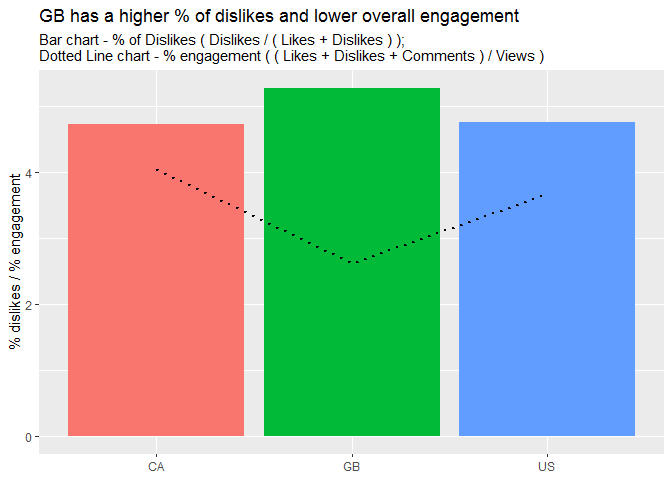<!-- -->

### 3.5.2. What are the most/least controversial categories?

``` r
#let's create a dataset at category level that we can use for further analysis
raw_data_eng <- raw_data %>%
  select(country, category_title, video_id, trending_date, likes, comment_count, dislikes, views) %>%
  group_by(country, category_title, video_id) %>%
  summarize (trending_date = max(trending_date),
             likes = max(likes),
             comments = max(comment_count),
             dislikes = max(dislikes),
             views = max(views),
             count= n(),
             unique_count = n_distinct(video_id))%>%
  group_by(country, category_title) %>%
  summarize (perc_engagement = round((sum(likes)+sum(dislikes)+sum(comments))/sum(views)*100),
             perc_likes = round((sum(likes)/(sum(likes)+sum(dislikes)))*100),
             perc_dislikes = round((sum(dislikes)/(sum(likes)+sum(dislikes)))*100),
             perc_comments = round((sum(comments)/sum(views))*100),
             likes = mean(likes)/1000,
             views = sum(views)/1000000000)%>%
  filter(!category_title %in% c("Shows", "Nonprofits & Activism", "Movies"))

ggplot(raw_data_eng) + 
  geom_bar(aes(reorder(category_title, perc_dislikes), perc_dislikes, fill = category_title), stat = "identity") +
  geom_line(aes(reorder(category_title, perc_dislikes), views), group = 1, lwd = 1, lty = 3) +
  facet_grid(~country) +
  theme(legend.position = "none") + 
  labs(y = "% dislikes",
       x = NULL,
       title = "The most disliked categories: News&Politics and Entertainment \nThe most liked categories: Comedy and Pets&Animals",
       subtitle = "Dotted line indicates unique videos across each category")+
  coord_flip()
```

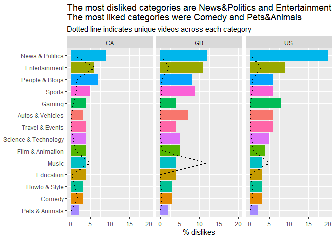<!-- -->

### 3.5.3. How do the countries differ based on the spread of the % of dislikes?

``` r
#we need to create a dataset at video level now to look at spread within categories
raw_data_eng_detail <- raw_data %>%
  filter (comments_disabled == FALSE, ratings_disabled == FALSE) %>%
  select(country, category_title, video_id, trending_date, likes, comment_count, dislikes, views) %>%
  group_by(country, category_title, video_id) %>%
  summarize (trending_date = max(trending_date),
             likes = max(likes),
             comments = max(comment_count),
             dislikes = max(dislikes),
             views = max(views),
             count= n(),
             unique_count = n_distinct(video_id),
             perc_engagement = round((sum(likes)+sum(dislikes)+sum(comments))/sum(views)*100),
             perc_likes = round((sum(likes)/(sum(likes)+sum(dislikes)))*100),
             perc_dislikes = round((sum(dislikes)/(sum(likes)+sum(dislikes)))*100),
             perc_comments = round((sum(comments)/sum(views))*100)) %>%
  filter(!category_title %in% c("Shows", "Nonprofits & Activism", "Movies"))%>%
  mutate(engagement_status = ifelse(perc_dislikes > 10, "negative", "positive"))


ggplot(raw_data_eng_detail) + 
  geom_boxplot(aes(reorder(category_title, dislikes), perc_dislikes, fill = category_title), outlier.alpha = 0.1, outlier.colour = "grey45") +
  facet_grid(~country) +
  theme(legend.position = "none") + 
  coord_flip()+
  labs(title="There are some videos in the News&Politics, Entertainment and \nPeople&Blogs that attract a disproportionately high % of dislikes", 
       x=NULL, 
       y="% Dislikes")
```

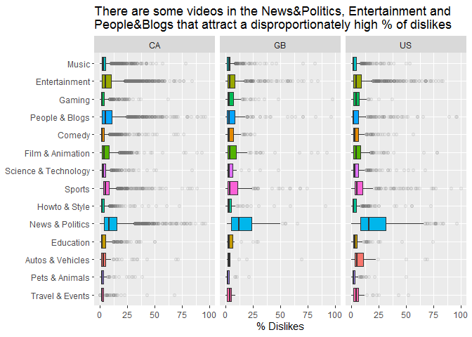<!-- -->

### 3.5.4. How do the countries differ based on the % of videos disliked?

``` r
ggplot(raw_data_eng) + 
  geom_col(aes(country, perc_dislikes, fill = country)) +
  facet_wrap(~category_title, as.table = FALSE) +
  theme(legend.position = "none") + 
  labs(y = "% Dislikes",
       x = NULL,
       title = "News&Politics videos (highest disliked overall) are more controversial in the \nUS (~20%) than in GB (~14%) and CA(~%8)",
       subtitle = "Entertainment and Sport videos are more controversial in the GB than US and CA \nThe three countries love Dog/Cat videos and Comedy equally (highest liked categories)")
```

<!-- -->

# 4\. Further analysis:

## Additional data fields that could provide an even better understanding:

#### a) Public Data:

  - **Subscriber count** (if made public) as they could be a significant
    contributor to views (especially soon after a video gets posted)
  - Other **social media profiles** (high fan base could contribute to
    the engagement)
  - **Share count** (on Facebook, Instagram, Reddit, etc)
  - **Video length**
  - **Search Engine Optimisation**

#### b) Private Data (only the creator can access these)

  - **Watch time** and **% of video watched** (ie. if a video has a
    total length of 10 mins, what gets watched on average)
  - **% Click Through Rate** (ie. out of 100 people that see a video’s
    thumbnail, what % clicks on it)

## Other uses for this dataset:

  - **Clustering** analysis to analyse different types of videos
  - **Regression** analysis to see if we can predict how many views a
    video will get / what contributed the most
